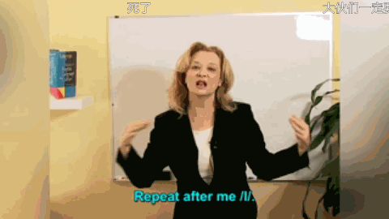
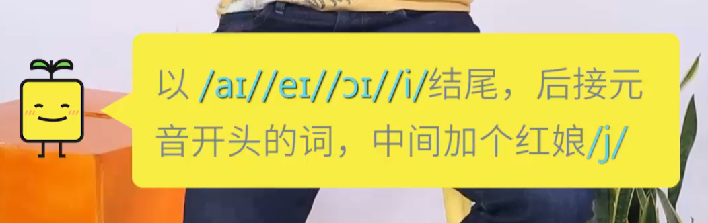
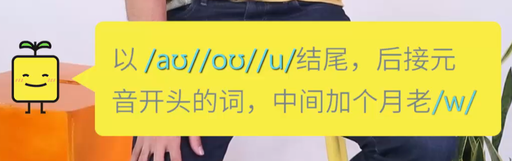

# BASICS

## 节目
 * Saturday night live
 * Rapper: Eminem
 * show: the Ellen show; Conan
## 国际美语音标

> 由于各家出版的美语词典所采用的美语音标符号不尽相同，以下一套符号尽量地折衷了各家所使用的符号，并最大限度地反映

> 音标  例词  音标  例词

> 元音

> [i]   seat, reed, rear

> [ɪ]   kit, built, hymn

> [eɪ]  rate, rain, break 

> [ɛ]   bet, bread, bare

> [æ]   sat, half, laugh  

> [ɑ]   lock, what, hard

> [ɔ]¹  dog, law, talk 

> [oʊ]  boat, rope, toe

> [ʊ]   put, look, wolf   

> [ʉ]   root, tube, group

> [ʌ]   cut, son, flood   

> [ɔɪ]  coil, toy, boy

> [aɪ]  tight, rice, sky  

> [aʊ]  lout, down, bough

> [ɚ]   hurt, chirp, perk 

> [ə]   about, circus, complete

> [ən]  taken, button, open  

> [əl]  label, paddle, toggle

> 辅音

> [p]   perk, pay, happy  

> [b]   bay, book, rabbit

> [t]   tail, button, locked 

> [d]   dear, add, filled

> [k]   key, catch, quite 

> [g]   game, ghost, guest

> [m]   male, mock, climb 

> [n]   nail, knife, gnat

> [ŋ]   think, sing, tongue  

> [h]   help, hit, who

> [f]   fee, phone, laugh 

> [v]   veal, vary, of

> [θ]   thick, throw, bath   

> [ð]   other, then, bathe

> [s]   send, cell, scent 

> [z]   rose, gives, zoo

> [ʃ]   shell, niche, mission   

> [ʒ]   garage, vision, azure

> [r]   core, hard, real  [l]   let, land, tell

> [w]   wit, where, quick 

> [j]   yes, onion, year

> （辅音变体）

> [p ̚]  nap, dip, top  

> [b ̚]  lob, cab, nib

> [t ̚]  lot, light, meat  

> [d ̚]  wade, send, garden

> [k ̚]  lock, like, meek  

> [g ̚]  big, rogue, egg

> [ʔ]   rent, button, cotton 

> [ɾ]   riddle, booty, center

> 1 美国东部有[ɔ]，西部则将其完全并入[ɑ]，儿化音[ɔr]除外。

> 

> 

## vowels

### Tense and neutral

张大嘴的用右半边歪嘴

* Fool full
* Hot hut
* Steal still

### 假笑i 子弹I
Not long or short, but tense or relax
#### 假笑i
美式不是长短音的区别,i也可以发的短
* usually usually 
* Early
* Movie movie
* These this
* Feeling
* She was feeling sleepy after eating the big meal.
* These three people speak Chinese.
* We love the green fields and the beach breezes.
#### [ɪ] 诶
发音类似汉语的“诶”但不全是，发音短促，介于/i/与/eɪ/之间的一种音，读的感觉很随意,不经意
* English
* There are six filthy dishes in the kitchen sink.
* The winter wind will bring a big chill
* Naive

### [ɑ] lock, what, hard
* 戏精，嘴唇较圆，张大嘴 Oh my god! You're so hot!
* 美语比较夸张，基本上o都发成a，要发长音 stop impossible发长音
* What
* want
* on
* MacDonald
* Robert
* Got
* Job
* Box
* Bot
* Not
* Hip hop击穿
* Tik Tok
* Bot
* Not
* Nock
* On
**美国东部有[ɔ]，西部则将其完全并入[ɑ]，儿化音[ɔr]除外。**
* The modern novel is very popular.
* Tom will watch hockey with his father.
* John will probably study biology in college.
* I'll not bother to respond to Tom's offer.
* If you gossip about your boss, you might lose your job.

### [ɔ]
注意[ɔ]张嘴较小，有点像奥了，是靠后的音。

1.学习该音发音方法请先学习/ɔː/和/ɪ/这两个单元音。发音时下颌张开，嘴唇略呈圆形，稍稍向外突出。舌前部收缩，舌后部向软颚抬起，但不要接触到软颚。舌身放松前探，舌尖轻触下齿，舌前部微微抬起。整个过程就是从/ɔː/音慢慢滑向/ɪ/。 
* dog, law, talk 
* Story
* daughter
* Call 
* Tall 
* Fall
* Small 
* Always 
* August 
* Automobile
* He is my audience
* applaud
* Applaud
* author
* Talk l不发音
* Walk  l不发音
* She is my audience
* Won't
* applaud applaud不用读太长，保持口型不变
* Saw
* Law
* Awful不用读太长，保持口型不变
* Pause
* Coffee
* He paused in the hall to talk with Paul.
* The author talked to the small audience.
* The author talked to the small audience.
* We all thought you bought it at the mall.
* We all thought you bought it at the mall.
* It's awful that he always breaks the law.
* He's exhausted because he's been rural King walking all day long.

### [ɔr]
注意[ɔ]张嘴较小，有点像奥了，是靠后的音。然后是明显的卷舌[r]
* floor
* short
* Airport
* Court
* door
* Your
* Yours y'alls yours yours yours
* record

### [ɔɪ]  coil, toy, boy
* Boy
* toy
* Royal

### [ʌ]   cut, son, flood
but中毒啊，张小嘴，比[ə]有力些
* Just
* Love
* Come
* Nut
* Lunch
* Other done
* month
* funny
* From
* We must discuss this with the other judge.
* My buddy Doug is a wonderful drummer.
* On Mondays he plays the drums in that club.
* On Sunday I had duck for lunch with my cousin.
* He doesn't study much and he loves to have fun.
* Doesn't study much and he loves to have fun.

### [ə]
 放松额
* cousin
* shot shut
* Don done
* lock luck good luck
* cop cup
* not nut
* robber rubber
* was was

### what
先准备好噘嘴w，然后基本上是[ʌ]，由噘嘴迅速变成夸张（tense）的t

### [ɚ]  hurt, chirp, perk,were, research, concern
* Her
* Teacher teacher
* Grammar
* Learn
* Heard
* First
* Bird
* Bird
**一定要记得是张小嘴的ə**
* Girl
* Work
* Worry w要往前噘嘴
* Word
* Word
* Work word
* Nurse
* Nurse
* Hurt
* Hurt
* Work early
* Early bird
* Perfect world
* It's your turn to work early on Thursday.
* I'm certain that mr. Turner has courage.
* Certain
* I heard that the first earthquake was the worst.
* Don't worry about learning those German words.
* The early bird always gets the worm.

### [u]
* root, tube, group
* Luke靠前，亲亲
* Soon
* Food
* Moon
* Blue
* True
* Due
* Tuesday
* Knew
* Two
* Suits
* You
* The report was due on Tuesday at noon.
* The report is due on Tuesday at noon.
* He knew the value of those two suits.
* He knew the value of those two suits.
* The crew uses a lot of new tools. 
* The crew uses a lot of new tools.
* In the future there will be new school rules.
* in the future there will be new school rules. 
* Susan wore her new shoes to school.
* Susan wore her new shoes to school.

### [ʊ] 
* put, look, wolf  
* Look good 发一半的u，发[ə]的音微微噘嘴就行了
* Should
* Look
* Took
* Shook
* Would 
* Could 
* Should
* Would like
* Look at a good book
* Push
* Pull
* Woman
* Football 
* Foot 
* The woman in the wool  pullover is good looking.
* The woman in the world pulled over is good looking.
* It would be good if you could help me.
* It would be good if you could help me.
* It would be good if you could help me.
* You should walk in the woods. 
* You should walk in the woods.
* You should walk in the woods. 
* You should walk in the woods.
* He took a good look under the hood.
* He took a good look under the hood. 
* He took a good look under the hood. 
* He took a good look under the hood.
* He spent his childhood playing football.
* He spent his childhood playing football. 
* He spent his childhood playing football.
* He spent his childhood playing football.
* Fool full
* I'm full.
* Luke look
* Pool pull

### [oʊ]   boat, rope, toe
比发欧更饱满些，欧开始然后有过度，最后落在ʊ上,from o to ʊ
* Road
* No
* So
* Mobike
* I don't know
* Post
* Most
* Go
* Moment
* Slow
* Flow
* Show
* Road
* coat 
* soap
* Boat
* Don't
* Bolt bolt boat bolt boat boat boat goat boat boat aunt boat vote both bolt don't boat boat boat both both both boat boat boat both both both both boat both both boat boat boat 先o然后快速ʊ，不要拉太长，太长就会成l
* Soap
* boat
* No I don't
* Don't go
* So slow
* Almost
* Almost over
* Lonely
* soldier
* zone
* The lonely soldier wrote home.
* The wind mostly blows over the ocean.
* Do you know who owns most of those homes?
* Let's watch the show in slow motion.
* He sold both of his boats.
* He sold both of his boats.

### [aʊ]   lout, down, bough
美式发音位置比较靠前，有些时候[aʊ]会变成[æʊ]
* How
* Vow
* Wow
* round  读英语要按音标发圆满，不要简化成一个中式的发音
* Discount
* Discount
* Discount
* The North Face
* Usually

### ju
* You you
* Use
* Beauty
* Thank you

### [aɪ]   tight, rice, sky
双元音，从一个音过度到另一个音，这样才发的饱满

New line line, ai first,  then n

New line line里面的ai要发饱满了

### [ɑr]注意儿化音
注意前面的[ɑ]要张大嘴发饱满,然后要有明显的卷舌的[r]
* Star
* garden
* Car
* far
* Hard
* Sharp

### [æ]
嘴要张开到位，时间要稍长
* sat, half, laugh  
* Hat 
* Hot
* Class 
* Math 
* Apple 
* Angry angry angry angry
* Man
* Dance
* Los Angeles
* Random.
* Random answer.
**æ first, then n.**
* Fat
* Class
* Dance class
* Los angeles, California.
* Last January Adam travel to Los Angeles California.
* Jack lacks cast because of a bad gambling habit.
* Frank is angry and he demands a fast answer.
* I bought my black jacket on my last trip to France.
* My family understands that I can't handle that matter.
* My family understand that I can't handle that matter.

### [ɛ]
张小口一指宽，嘴部肌肉像微笑向两边，舌头放松放在下牙后面，不经意的感觉
* bet, bread, bare
*  better
* weather
* pleasure
* Again

### [eɪ]   rate, rain, break,Kate
先[e]然后平滑到[ɪ]
* Wait
* play
* Gray
* Taste
* shake
* Hate
* Monday
* Tuesday
* Wednesday
* Thursday
* Friday
* Saturday
* Sunday

## consonants

### n

/n/:微微张开嘴巴，舌尖紧贴上齿龈，形成阻碍。气流从鼻腔泄出，同时声带震动发出声音。n/是个鼻音、浊辅音，依靠声音震动发声，当/n/出现在音节结尾处时要略微延长。/ŋ/:嘴唇张开，舌后部抬起贴住软腭，阻止气流从口腔泄出。 2）软腭下垂，气流从鼻腔泄出，同时震动声带发音。 放在熟悉的单词中去感受，sin，sing

* Sign 
* fine
* 9
### t&d&l&n
发这三个音的时候舌尖都不要碰到牙齿，碰牙龈。n的舌头大面积接触牙龈

齿龈-牙根周围的粉红色黏膜组织，内有血管和神经。通称牙床。如果碰到了牙齿就往回收一些，碰到牙根没关系。

### [ŋ] 
嘴巴张开，舌头抬起时贴住软腭，阻止气流从口腔泄出,软腭下垂，气流从鼻腔泄出，同时震动声带发声,ŋ是个浊辅音，声带振动

#### the 'ING' sound

Iŋ是后鼻音，舌头后部上贴，跟发“哥”音的位置相近，舌头不用放松下来，或者就放下来一丢丢。

* working
* Doing
* Going
* thinking
* Sing
* Interesting
* I am thinking about buying the ring.
* Who are you bringing to the wedding?
* I know swimming, running, and playing tennis.
* Iŋ后面连读的话化成n  
* think  
* Each has his own task and nobody's dispensable.  
* Each has his own task and nobody's dispensable.
连读是自然的，不要为了连读而连读，连读的时候要想着连读前的单词，并注意节奏。

h的略读还是有一点h的
* think, sing, tongue
* Long lɔŋ  要落回到鼻音上
* monkey
* Swimming
* running
* Sing

### l

舌头轻轻停在上牙后面,先发音然后把舌头轻舔在上颚,l只发前半部分的了

* Tall
* Feel
* Girl
* He will 
* He'll
* Well  甚至可以试着把后半部分发出来读成“well了”

#### Light L

  

区分l和n，l是舌尖一点抵住上颚，n是舌头大面积抵住上颚

  

#### Dark L

  

舌头后缩

  

发这两个音时，口型要保持不变，只是舌头伸和缩

  

打哈欠体会舌头收缩

  

Dark L不要用嘴唇做，嘴唇基本不动，用舌头收缩发音。如果用嘴唇就会发成O的音

不必要全头用力,舌头灵活伸缩

dark L主要是舌根用力上抬，舌尖可以在后期贴上牙后牙龈，以便于后面变成light L连读:吁呜ld,deal分三部分:第一是dea舌头正常发i；第二步发darkL的前半部分即舌根部分用力上抬，注意这时舌尖不要卷起；第三步舌尖伸出贴上颚发lightL的位置。

  

* Eagle
* people
* Always
* Tall
* Call
* Small
* well
* Girl
* Girl
* Tall
* Small
* Small little girl
* I'm full
* tell me
* local
* label
* legal
* ??? Logical
* ??? local
* ??? Feel  feel fi-l
* kill
* ??? loyal
* level level
* World
* Charles
* ??? for sale
* ??? All of it
* All.
* Bill bill bill bill
* Bicycle bicycle bicycle bicycle
* ??? Political
* old  old old
* illegal illegal
* cultural
* I will call you to tell you about the film.
* I feel terrible about the political scandal.
* I think I'll be able to handle it by myself.
* You will do well at school.
* ??? heal hi-l heal heal seal heal heal
* It may heal you.
* cool cool cool
* Help
* ??? Peel. Pee(y)l
* Here here here here here here here here shear Pier Pele here here she'll Pier Pier shiro Pele Pele Pier Pele here hero Pele pia Pele q Peter Pele
* ??? deal dea(y)l
* Deer deer deal deal deer deal beer deer deal gear deer steel feel deer deer deer deer deer deal deer deal d deer
* ??? Pool pu(w)l
* Cool cool cool cool true cool cool cruel cool pool so pool frou frou cruel cruel cool full full full
* ??? While
* Why Ryder why why while why are you why are you why are you why are you why while while why
* Word world world

#### Lisa's method is better and more useful

**so the tongue is relax and it touches right behind the upper teeth and it stays there. So the American L is prolonged. It's softer and longer.舌头放轻松放在牙龈和上颚交接的突起处，轻放，温柔并拉长。大舌头的感觉。就是后面lou把ou不发出声音，并且舌头改为轻放**

* she'll
* I'll
* he'll
* I'm calling you to tell you about the film.
* I feel terrible about the political scandal.
* I think I'll be able to handle it by myself.
* You will do well at school.
#### elk
We're going to add a k at the end of the word and say the word ELQ.

The K is pronounced with the back of your tongue raised and this will help you feel the placement of the tongue for the dark L.

**注意l如果跟后面的元音拼的话就不用发dark l的音了，feeling, tallest, I fell over yesterday.**

#### 美语里l不与后面的ju拼
* value
* volume
* w
### R [r] core, hard, real

The American R is never silent. 

The tip of your tongue should never touch the top behind your upper teeth. The tip of your tongue curls and we pull it back.

基本上就是北京的儿化音。

* Your
* Four
* More
* other
* Learn
* German
* Robert
* First person
* Their computer isn't working.
* I gave her the four other pictures.
* Her fourth birthday is on Thursday.
* Her fourth birthday is on Thursday.
* There are many more over there.
* We were the first to arrive at the park.

### [θ] thick, throw, bath   [ð]   other, then, bathe
* is the: 先发iz，然后发th时舌尖抵上牙尖代替咬舌
* Think
* Thank
* North
* South 
* Mouth
* Take a bath
* Choose a path

th在最后的时候，前面的元音要发圆满稍长，然后用舌头尖或者舌头中部通过舌头左右搅动发出呲气声

Be careful that your tongue doesn't touch too hard on your other teeth. Because if it does then you're not going to have any air coming through. You're going to be blocking the airflow. Make sure that your tongue slightly touch it. 

If your tongue is too far inside and if it's not touching the teeth, the sound is going to be [s] instead of [θ].

Make sure that your tongue touches the teeth. It doesn't to be very visible. If you speak like that it could slow down your speech. Song if you noticed American people don't stick out to that tone very much when they're producing the th. But they do touch the teeth with the tongue.

舌头有伸出来一部分，不伸出来就会像s、z；但是不要咬紧，要轻些, 要有气流可以流出，咬紧就会像t d。大概伸出舌头的过了舌尖肉厚的那个地方轻一点就行了。大舌头的感觉。

* bath
* both
* math
* Thank you
* Thursday
* father
* Mother
* Thirsty
* I'm thirsty. Is there anything to drink in this place?
* I thought it was on Thursday at 3:30.
* This is my fourth month studying math.
* Both my mother and my father are healthy.
* Both my mother and my father are healthy.
* I think Matthew lives in the North.
* with
### s&z
上了音标课才发现is，was，he‘s，she's里面的s音标都是/z/，为什么这么多年都完全没听出来呢，感觉美剧电影里他们读的也是/s/。

/z/读的很轻时确实听上去像s，这个听音辨音能力大部分人都不具备
* mrs.
* Miss 
* Ms

### W

Round your lips and let the air flow out. It feels like I'm blowing a balloon.

关键在于发音开始前的嘴型：像要吹气球前吸好气的动作，嘴形呈圆形。

### ??? tw qw

在two里面tw是一起读的

在twelve和twenty和between里面tw是分开发的，t要很快

**Your mouth will actually pronounce the T with the rounded lips of the w  sound. The t&w will be combined into one sound here.**

先按twelouv读，再把ou去掉，并且舌头改为轻放。

Twelve

Twitter

但是qw又是连起来读的

Quick

## skills

### 音节

一个元音(包括单元音和双元音)是一个音节  

重读就是那个元音拉长些，音调升高些  

英文发音中有发完整和一半就收住，这点跟中文不同

### 重读

重读就是加长所重读音节里的元音
* Canada Canada
* banana
* Biology
* photography photography
* I love it.
* I have to call him.
* Skyscraper

句子里重读的单词一样也要加长所重读单词的元音

* I love my class.
* I love my new job.
* You're really tall.
* It's hot.
* Let's go to the park.
* I got a job at the hospital.

### [ɾ] riddle, booty, center

舌头稍微翘起来弹舌

* Better
* getting better
* Ladder
* Later
* writing a letter
* Doesn't matter
* Little bit
* Italy
* Attack 
* yes it is
* Automatic
* Not at all 先not at, then at all
* A little bit of
* I'm a writer ai要发圆满，弹舌要轻一点。
* What are you
* Let it go let it go play it again let it go let it go let it go let it go let it go let it go （it的t虽然不发音，但是有发音的动作，所以会造成i后面稍微的停顿）
* Nobody
* Get up 
* What's the matter 
* The butter tastes bitter
* Do you want some better butter
* get out of here.  get out.  out of
* all over
* Take over take over take over
* I got up at 11.
* Do you want to get in or get out?
* I bought it at a computer store.
* What a nice day it is.

### 连读
把音读到位自然就出来连读了，特别是n,l,u之类的

#### 辅元连读

ju其实算半元音，可以和其前面的辅音连读

* Thank you kju
* It's very kind of you vju
* not at all
* Get out of here
* stressed out
* All over all over
* get up
* Take over
* Just a little bit of
* What about it ice age
* I've seen the beginning of it, not all of it.
* Hey it is movie night. what movie do you want to watch.
* Good idea! I like it! Can't believe you haven't seen it before.
* All right. I'm gonna play it for you.
* Stop it
* workout
* Feel excited
* Confidence is the difference. 这里的confidence和is不连读，因为要强调confidence。一般不是句子里强调的关键词才连读。
* Sing a song不连读

#### 辅辅连读

* Get tired
* Got tired of it
* feel like
* last time
* You look cool in those jeans.
* good movie前面被略读的辅音的口型还是要做的
* Such a good movie
* Credit card
* Sit down
* The squirrel is so funny.
* Can't wait for next week
* Can't wait for next week
* Wow such a good movie
* I just can't get tired of it
* who doesn't
* don't look at me
* I tried to tell you last night

##### stops and continuants

Another way we categorize consonants besides voiced and voiceless is whether they are stops or continuants.

A stop is a consonant that is produced when we stop the airflow. "Job" is a stop because we cannot pronounce the 'b' continually like 'b' 'b' 'b'... A continue is a consonant that we can pronounce it continually as long as there are air in our lungs. I can say 'yesssss'.

A lot of people treat continuant like a stop. so take your time and fully pronounce the continuants. Prolong the continuants.

* Sometimes.
* have
* Do not release the stop if the stop is before a consonant.
* Pop music
* I love my new job.
* Job market
* Had this
* Job hunting
*  top model
* good boy
* that day
* not now
* No it's not
* I'm not that hot
* quite great
* you quiet right
* I can't go I can't go
* I can't do it
* I want that blue hat
* Robert, you might be right.
* It's not that different
* What did you eat last night?
* did you
* I can't wait for that flight. 虽然不发音，但是略微的停顿是有的。

#### 元元连读

##### 加j

* May I have some milk tea
* day off
* Mentium diamond. A human being Dean and Dale India India
* Day in and day out
* Lie on the floor. Lie要念完整
* The other
* I owe you an apology

##### 加w

* You are
* How are you
* How are you doing
* Do it for what
* Go away
* he's
* the best I ever had
* Say it
* who else
* I know it
* Just do it yourself. I'm gonna see Angelababy.
* I'm going to lie in my bed and watch her show. **Watch击穿her的h**
* May I have some milk tea?
* how lucky you are! when will you go? **will和you连读**
* I thought you were gonna see her in person

### [ʔ] rent, button, cotton

还是要做要发t或者d的动作的

喉塞音

when t or d followed by n

T的吞音，像嗯又不像嗯的音,丹田发音

会导致前面的元音略微变短

喉塞音的关键在于前面元音的收住和停顿。

发音t被声门闭塞的声音代替，以至于听起来像是在说话中停顿或者跳过了这个音节。在第一个音节末尾含住舌根的气息，然后在发第二个音节的时候才把它吐出来。

在第一个音节末尾含住舌根的气息，然后在发第二个音节的时候才把它吐出来。(fountain → foun'ain, button → but'en)

发音方法是闭塞，即是通过阻碍空气在声腔流动来发音。发音部位是声门，通过声门闭塞而发音。喉塞音就是不读出t/d来，突然收声缩短前面的元音

保持发t的动作，舌头抵上牙，由鼻孔出气流发n。

一顿的感觉

* uh oh
* Important
* eaten
* Certainly
* Certainly
* Beaten
* Hidden
* In the garden
* Midnight
* Burden
* button
* written
* Button button
* What I eat in a day
* What I eat in a day
* I am certain that's the tallest mountain.
* My cotton shirt has buttons.
* I have forgotten when the book was written.
* Martin was born in great Britain.

### 清浊 voiced and voiceless consonants

清音不送气

清音声带不震动

浊音声带震动

还有清音不送气的，不是浊音
* Adopted
* make it
* happen

有些不送气的清音发出来感觉声带震动的浊音是因为带着后面的元音，所有的元音都是浊音

汉语里面的bdg实际上不是浊音，而是清音不送气

A consonant can be either voiced or voiceless. All vowels are voiced.

A voiced consonant or vowel is pronounced with vibration of vocal cords.

Ed

The vowel before the voiced consonant is pronounced longer than the vowel before the voiceless consonant.

* Ice eyes
* Back bag
* Safe save
* Pick pig
* lock log
* Light lied
* Leaf leave
* Cup cub

#### 浊音

**念出足够浊的浊音，或者说避免发成你说的"不送气清音"，我们的确可以采用在bdg等浊塞音前加一个相对应的鼻音m/n/ng来带动这个塞音。但是m只适用于同样是双唇音的b；而d更适合加n，g前加ng。其他的浊辅音也基本上是这样在前面加一个合适的鼻音来发音。**

所以，my baby的夸张浊音读法为：my m~mbaby! （m的持续时间根据你个人喜好控制）

这种方法需要注意的地方在于，并不是见到bdg等浊塞音就要在前面加鼻音，因为得看是否重读，以及前面是否有清音食之清化。

比如I know he's a baby, but I didn't know he's a fat baby.

前半句的baby因为是被强调的，而且前面是元音a，所以浊化程度比较高。

后半句的baby因为不被强调（旧信息），而且前面的是清音t，所以浊化程度很低，甚至没有。

#### 清清浊浊

单词后面加s，清音后面就发清音s，浊音后面就发浊音z

### Ed
* t,d ending: [Id]
* voiced ending: [d]
* voiceless ending: [t]

### 'TU' and 'DU' sounds同化现象
#### 'TU' chew: t followed by j
* Actually
* Statue
* Nature
* can't you
* Meet you meet you meet you
* Last year
* Got your back
* Why can't you do it
* Aren't you hungry?
* Why won't you come
* Why won't you help me
* Let you
* No problem. meet you at the old place.
* Want you
* Unto until until until until until until onto onto until I'm too aren't you aren't you onto onto aren't you onto aren't you on cue aren't you aren't you aren't you aren't you. !**[arnt]**真是要严格按照音标来念啊，不要简化成汉语发音
* Aren't you graduating in the spring?
* Can't you see the statue
* You'll see
#### 'DU' new
* Graduate
* Education
* Schedule
* Individual
* Did you
* Did you call me
* Did you come
* Could you
* Would you like something to eat
* Would you like to see the schedule?
* Did you get a college education
* Need you
* Who do you
* When do you
* How do you
* What do you
* I failed you
* Find your voice

#### s followed by j becomes to [ʃ]
现在美国年轻人不怎么这么说了
* Miss you
* Bless you
* Dress yourself
* I miss you too.  but I need you to wait for a while. I'm almost done with work.
* Hi Marin. This is Lisa. I miss you so much.

#### z followed by j becomes to [ʒ]
* How's your day
* How's your family
* How's your boyfriend
* When's your birthday
* By the way how's your new boyfriend?

### 缩读
* 装垫儿台
* 酱紫

#### 缩写形式的缩读
* I'm [aɪm] 
* You're
* it's
* He's
* She's
* I've
* you've

#### to的缩读
* I wanna
* I gotta
* Gonna
* I'm gonna
* You've gotta go
* We wanna do that
* He's gonna take it
* It's kinda sad
* Actually I'm gonna meet my friend soon.
* I met her last night so I couldn't tell you earlier
* I wish I could say that
* Hey ice, I'm kinda bored. what you wanna do?
* What! you have other friends? you should have told me.
* Her? Come on!  just tell me she's your girlfriend.

#### of的缩读
* I think I'm kinda handsome
* I think I'm kinda handsome  [kaɪnə]
* I'm kinda tired

#### have的缩读
* coulda could have
* Shoulda should have
* I shoulda been rich.

### Fully pronouncing each consonant

要发饱满

Don't take any shortcuts instead of fully pronouncing each consonant.

Fully move your lips.

Probably

Fully move your tongue

General

Pronouncing each sound doesn't mean having to speak very slowly.

Don't be lazy

* 7
* 12 12
* I need $5

### 重读与弱读
#### 重读
重读就是加长所重读音节里的元音

* His daughter is doing her homework right now.
* She lives and works in Italy.
#### 弱读 Reduced vowels

结尾不强调的音弱化成ə

* symbol
* Local
* Local
* record
* because 
* become
* 一般介词不强调的时候也会弱化成ə，比如at, for, in, on, with, by等。这些接触要读的很轻
* O'clock ə
* Look at me ət
* I'd like to talk to you 
* I'd like tə talk tə you
* I'm looking for you
* I'm looking fər you
* Let's meet at 2:00
* I'd like to talk to the pilot
* Let's meet for breakfast.
* I'd love to go for a walk
* I'd love to go for a walk.

* to [tə]
* for [fə]
* have to [hæftə]
* her [ɚ]
  * Tell her
* Where are you: are [ə]
* him [ɪm]
  * Ask him
* he [i]
  * What's he saying
* and [ɛn]
  * You and me
* The flowers are for you.
* Give it to me
* Alice is a coder.
* She's at home.
* she's at home
* Let's go for a walk
* He talked to me
* Those are black and white
* I saw them on the desk
* Oh I thought they're yours. I don't even know Eddie wears glasses.
*  you know he talks a lot
* Lisa, did you see my glasses?
* Come on! you know everything about Eddie.
* Maybe just you. look! those are my glasses.
* I'm gonna fight for you.
* she listens to you.
* Go to school里的to不弱读！

### 语调
#### 降调：陈述,祈使，感叹
* That's rude
* I really can't do it
* You didn't mean it
* don't do it
* You are so rude
#### 疑问句
##### 一般疑问句结尾升调，可以用yes或no来回答的
* Are you kidding me?
* You can buy me a drink. can't you?
* You going home aren't you?
* Do you have his phone number?
* She's from the US, isn't she?
##### 特殊疑问句用降调：不能用yes或no回答的疑问句
* What's wrong?
* What's your name?
* What's wrong with you?
* What time is the meeting?
* How are you doing?
##### 选择疑问句：高平，高平，降
* 这些都是要根据具体语境而定的，课程上总结的只是大部分情况。而且语音语调因人而异，可以自己做决定，选择更为舒服的表达（白人女孩儿喜欢用升调
* Would you like some tea, coffee, or water?
* Do you like jazz, hip-hop, or Rock?
* Do you want to play football basketball or baseball?

# Mike's

Water

Get in

A lot of water

A cup of tea

She is hungry. She(y)iz hungry.

She ate a burger. She(y) ate a burger.

That boy is hungry. That boy(y)iz hungry.

See Andrew

Do it. Do(w)it.

Go in. Go(w)in.

You are. You(w)are.

Go out. Go(w)out.

How are you. How(w)are you.

Do it. Do(w)it.

He asked me for two apples.

Did he get it. Di-diy ge-dit.

He iy

him im

his iz

her er

has as

have ave

There's an elephant in the garden.

I ate an apple and two pears.

Those are the best tomatoes I've ever had.

Old man. Ol man.

Gold ring. Gol ring.

Most famous. Mos'famous.

Hand bag. Han bag.

Next day. Nex day.

World relationship. Worl relationship.

That time

Red dress

Cheap places

Feel lucky

Quite tall

Nice sofa

Cheese sandwich

Breathe through

Each choice

Orange juice

Need two

She asked David

Dark green

Sleep better

Enough vests

What do you want. Whatchu want.

Would you. Wouldzhu.

Pen Open

Making

Come back again

Apartment

Lately

Patent

Button

Certainly

Oh Oh ?o ?o

Genneral Patton

President Clitton

Important

Accountant

Seventy

Going to

I need to go.

Twenty

Interview

International

Wanted

Isn't it

Plenty

Rental

Dental

Santa Claus

跟他讲

Gen Na Jiang

t﹁是塞音，不是擦音

This thought is good.

Breathe it.

Both are

Worth it

Throw

Through

d︹是塞音，不是擦音

The

There

Seventy-five

Father

Mother

Other

Fifteen  

Fifty

b d g 声带震动的浊音

Down

Town

Found

Sound

At first

Off at

Advertise

Throw

Through

Three

Last train

Last strain

I'd never

I never

Wednesday

Have you ever ridden a horse

Written

DL

I'd like

TL

Looked like

  

TY→CH: Can't you

DY→J: Would you

SY→Sh: miss you;sure

SY→ZH: because you; measure

Exchange

Price change

Last chance

  

缩写不是为了缩短，而是因为有这种缩写的说法

Have to be f

  

I live on Williams street. 鼻音

om Tom闭口结尾

 on 呢音结尾

 ong喉咙发音 long

cause because
