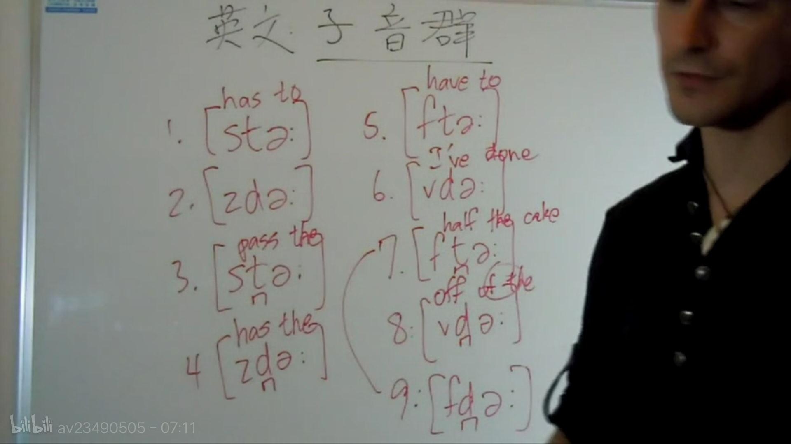

# BASICS
## 节目

 Saturday night live
 M.nam

## 国际美语音标

> 由于各家出版的美语词典所采用的美语音标符号不尽相同，以下一套符号尽量地折衷了各家所使用的符号，并最大限度地反映
> 音标  例词  音标  例词
> 元音
> [i]   seat, reed, rear
> [ɪ]   kit, built, hymn
> [eɪ]  rate, rain, break 
> [ɛ]   bet, bread, bare
> [æ]   sat, half, laugh  
> [ɑ]   lock, what, hard
> [ɔ]¹  dog, law, talk 
> [oʊ]  boat, rope, toe
> [ʊ]   put, look, wolf   
> [ʉ]   root, tube, group
> [ʌ]   cut, son, flood   
> [ɔɪ]  coil, toy, boy
> [aɪ]  tight, rice, sky  
> [aʊ]  lout, down, bough
> [ɚ]   hurt, chirp, perk 
> [ə]   about, circus, complete
> [ən]  taken, button, open  
> [əl]  label, paddle, toggle
> 辅音
> [p]   perk, pay, happy  
> [b]   bay, book, rabbit
> [t]   tail, button, locked 
> [d]   dear, add, filled
> [k]   key, catch, quite 
> [g]   game, ghost, guest
> [m]   male, mock, climb 
> [n]   nail, knife, gnat
> [ŋ]   think, sing, tongue  
> [h]   help, hit, who
> [f]   fee, phone, laugh 
> [v]   veal, vary, of
> [θ]   thick, throw, bath   
> [ð]   other, then, bathe
> [s]   send, cell, scent 
> [z]   rose, gives, zoo
> [ʃ]   shell, niche, mission   
> [ʒ]   garage, vision, azure
> [r]   core, hard, real  [l]   let, land, tell
> [w]   wit, where, quick 
> [j]   yes, onion, year
> （辅音变体）
> [p ̚]  nap, dip, top  
> [b ̚]  lob, cab, nib
> [t ̚]  lot, light, meat  
> [d ̚]  wade, send, garden
> [k ̚]  lock, like, meek  
> [g ̚]  big, rogue, egg
> [ʔ]   rent, button, cotton 
> [ɾ]   riddle, booty, center
> 1 美国东部有[ɔ]，西部则将其完全并入[ɑ]，儿化音[ɔr]除外。
> 
> 

## Tense and neutral
张大嘴的用右半边歪嘴
Fool full
Hot hut
Steal still

## 假笑i 子弹I
Movie movie
美式不是长短音的区别
[i] [ɪ]
Not long or short, but tense or relax
These this
Feeling
She was feeling sleepy after eating the big meal.
These three people speak Chinese.
We love the green fields and the beach breezes.
There are six filthy dishes in the kitchen sink.
The winter wind will bring a big chill
## [ɑ] lock, what, hard
   戏精，嘴唇较圆，张大嘴 Oh my god! You're so hot!
   美语比较夸张，基本上o都发成a，要发长音 stop impossible发长音
   on
   MacDonald
   Robert
   Got
   Job
   Box
   Bot
   Not
   Hip hop击穿
   Tik Tok
   Bot
   Not
   Nock
   On
   美国东部有[ɔ]，西部则将其完全并入[ɑ]，儿化音[ɔr]除外。
   The modern novel is very popular.
   Tom will watch hockey with his father.
   John will probably study biology in college.
   I'll not bother to respond to Tom's offer.
   If you gossip about your boss, you might lose your job.
## [ɔ]
dog, law, talk 
Call 
Tall 
Fall
Small 
Always 
August 
Automobile
He is my audience
applaud
Applaud
author
Talk
Walk
She is my audience
applaud applaud不用读太长，保持口型不变
Saw
Law
Awful不用读太长，保持口型不变
Pause
He paused in the hall to talk with Paul.
The author talked to the small audience.
The author talked to the small audience.
We all thought you bought it at the mall.
We all thought you bought it at the mall.
It's awful that he always breaks the law.
He's exhausted because he's been rural King walking all day long.
## [ʌ]   cut, son, flood
but中毒啊，张小嘴，比[ə]有力些
Just
Love
Come
Nut
Lunch
Other done
We must discuss this with the other judge.
My buddy Doug is a wonderful drummer.
On Mondays he plays the drums in that club.
On Sunday I had duck for lunch with my cousin.
He doesn't study much and he loves to have fun.
Doesn't study much and he loves to have fun.
## [ə]
 放松额
 cousin
 shot shut
 Don done
 lock luck good luck
 cop cup
 not nut
 robber rubber
 [ə]  about, circus, complete,was
## [ɚ]  hurt, chirp, perk,were, research, concern
 Her
 Teacher teacher
 Grammar
 Learn
 Heard
 First
 Bird
 Bird
 一定要记得是张小嘴的ə
 Girl
 Work
 Worry w要往前噘嘴
 Word
 Word
 Work word
 Nurse
 Nurse
 Hurt
 Hurt
 Work early
 Early bird
 Perfect world
 It's your turn to work early on Thursday.
 I'm certain that mr. Turner has courage.
 Certain
 I heard that the first earthquake was the worst.
 Don't worry about learning those German words.
 The early bird always gets the worm.
## [u]
root, tube, group
Luke靠前，亲亲
Soon
Food
Moon
Blue
True
Due
Tuesday
Knew
Two
Suits
The report was due on Tuesday at noon.
The report is due on Tuesday at noon.
He knew the value of those two suits.
He knew the value of those two suits.
The crew uses a lot of new tools. 
The crew uses a lot of new tools.
In the future there will be new school rules.
in the future there will be new school rules. 
Susan wore her new shoes to school.
Susan wore her new shoes to school.

## [ʊ] 
put, look, wolf  
Look good 发一半的u
Should
Look
Took
Shook
Would 
Could 
Should
Would like
Look at a good book
Push
Pull
Woman
Football 
Foot 
The woman in the wool  pullover is good looking.
The woman in the world pulled over is good looking.
It would be good if you could help me.
It would be good if you could help me.
It would be good if you could help me.
You should walk in the woods. 
You should walk in the woods.
You should walk in the woods. 
You should walk in the woods.
He took a good look under the hood.
He took a good look under the hood. 
He took a good look under the hood. 
He took a good look under the hood.
He spent his childhood playing football.
He spent his childhood playing football. 
He spent his childhood playing football.
He spent his childhood playing football.
Fool full
I'm full.
Luke look
Pool pull
## [æ]
嘴要张开到位，时间要稍长
sat, half, laugh  
Hat 
Hot
Class 
Math 
Apple 
Angry angry angry angry
Man
Dance
Los Angeles
Random.
Random answer.
**æ first, then n.**
Fat
Class
Dance class
Los angeles, California.
Last January Adam travel to Los Angeles California.
Jack lacks cast because of a bad gambling habit.
Frank is angry and he demands a fast answer.
I bought my black jacket on my last trip to France.
My family understands that I can't handle that matter.
My family understand that I can't handle that matter.
## [ɛ]
张小口，舌头放松放在下牙后面
bet, bread, bare
[ɛ]   bet, bread, bare
张很小的嘴，舌头轻放在下牙后面
## [ŋ] 
think, sing, tongue
Long lɔŋ  要落回到鼻音上
嘴巴张开，舌头抬起时贴住软腭，阻止气流从口腔泄出,软腭下垂，气流从鼻腔泄出，同时震动声带发声
ŋ是个浊辅音，声带振动
和拼音中的ng很像，可以先把拼音中的ang,ing,eng练一下
放到单词里面读就行
## [aɪ]   
双元音，从一个音过度到另一个音，这样才发的饱满
New line line, ai first,  then n
[aɪ]  tight, rice, sky
New line line里面的ai要发饱满了
## [eɪ]   rate, rain, break,Kate
[ɪ]   kit, built, hymn

## [oʊ]   boat, rope, toe
Road
No
So
Mobike
比发欧更饱满些，欧开始然后有过度，最后落在ʊ上
from o to ʊ
I don't know
Post
Most
Go
Moment
Slow
Flow
Show
Road
coat 
soap
Boat
Bolt bolt boat bolt boat boat boat goat boat boat aunt boat vote both bolt don't boat boat boat both both both boat boat boat both both both both boat both both boat boat boat 先o然后快速ʊ，不要拉太长，太长就会成l
Soap
boat
No I don't
Don't go
So slow
Almost
Almost over
Lonely
soldier
The lonely soldier wrote home.
The wind mostly blows over the ocean.
Do you know who owns most of those homes?
Let's watch the show in slow motion.
He sold both of his boats.
He sold both of his boats.
## [aʊ]   lout, down, bough
How
Vow
Wow
Discount
Discount
Discount
The North Face
Usually
## ??? l n
l只发前半部分的了
Tall
Feel
Girl
He will 
He'll
Well
甚至可以试着把后半部分发出来读成“well了”
舌头轻轻停在上牙后面
先发音然后把舌头轻舔在上颚

### Light L
  
区分l和n，l是舌尖一点抵住上颚，n是舌头大面积抵住上颚
  

### Dark L
  
舌头后缩
  
发这两个音时，口型要保持不变，只是舌头伸和缩
  
打哈欠体会舌头收缩
  
Dark L不要用嘴唇做，嘴唇基本不动，用舌头收缩发音。如果用嘴唇就会发成O的音
不必要全头用力,舌头灵活伸缩
Eagle
people
Always
Tall
Call
Small
well
Girl
Girl
Tall
Small
Small little girl
I'm full
tell me
local
label
legal
??? Logical
??? local
??? Feel  feel fi-l
kill
??? loyal
level level
World
Charles
??? for sale
??? All of it
All.
Bill bill bill bill
Bicycle bicycle bicycle bicycle
??? Political
old  old old
illegal illegal
I will call you to tell you about the film.
I feel terrible about the political scandal.
I think I'll be able to handle it by myself.
You will do well at school.
??? heal hi-l heal heal seal heal heal
It may heal you.
cool cool cool
Help
??? Peel. Pee(y)l
??? deal dea(y)l
??? Pool pu(w)l
??? While
Word world world
###  dark L主要是舌根用力上抬，舌尖可以在后期贴上牙后牙龈，以便于后面变成light L连读:吁呜ld
  
###  注意l如果跟后面的元音拼的话就不用发dark l的音了，feeling, tallest, I fell over yesterday.
### 美语里l不与后面的ju拼
   value
   volume
   w
## !!!r
## 音节
一个元音(包括单元音和双元音)是一个音节  
重读就是那个元音拉长些，音调升高些  
英文发音中有发完整和一半就收住，这点跟中文不同

## 重读
重读就是加长所重读音节里的元音
Canada Canada
banana
Biology
photography photography
I love it.
I have to call him.
Skyscraper

句子里重读的单词一样也要加长所重读单词的元音
I love my class.
I love my new job.
You're really tall.
It's hot.
Let's go to the park.
I got a job at the hospital.
## Reduced vowels
结尾不强调的音弱化成ə
symbol
Local
Local
record
一般介词不强调的时候也会弱化成ə，比如at, for, in, on, with, by等。这些接触要读的很轻
O'clock ə
Look at me ət
I'd like to talk to you 
I'd like tə talk tə you
I'm looking for you
I'm looking fər you
Let's meet at 2:00
I'd like to talk to the pilot
Let's meet for breakfast.
I'd love to go for a walk
I'd love to go for a walk.
## [θ] thick, throw, bath   
Think
Thank
North
South 
Mouth
Take a bath
Choose a path
th在最后的时候，前面的元音要发圆满稍长，然后用舌头尖或者舌头中部通过舌头左右搅动发出呲气声

## [ɾ] riddle, booty, center
Better
getting better
Ladder
Later
writing a letter
Doesn't matter
Little bit
Attack 
Not at all 先not at, then at all
A little bit of
I'm a writer ai要发圆满，弹舌要轻一点。
Let it go let it go play it again let it go let it go let it go let it go let it go let it go （it的t虽然不发音，但是有发音的动作，所以会造成i后面稍微的停顿）
Nobody
Get up 
What's the matter 
The butter tastes bitter
Do you want some better butter
get out of here.  get out.  out of
all over
Take over take over take over
## 连读
ju其实算半元音，可以和其前面的辅音连读
Thank you kju
It's very kind of you vju
Feel excited
Confidence is the difference. 这里的confidence和is不连读，因为要强调confidence。一般不是句子里强调的关键词才连读。
Sing a song不连读
## [ŋ]   think, sing, tongue  
Iŋ后面连读的话化成n  
think  
Each has his own task and nobody's dispensable.  
Each has his own task and nobody's dispensable.
连读是自然的，不要为了连读而连读，连读的时候要想着连读前的单词，并注意节奏。
h的略读还是有一点h的
## [ʔ] rent, button, cotton

还是要做要发t或者d的动作的
喉塞音
when t or d followed by n
T的吞音，像嗯又不像嗯的音,丹田发音
会导致前面的元音略微变短
喉塞音的关键在于前面元音的收住和停顿。
uh oh
Important
eaten
Certainly
Certainly
Beaten
Hidden
In the garden
Midnight
Burden
button
written
Button button
What I eat in a day
What I eat in a day
## [ɑr]注意儿化音
garden
## 清浊
清音不送气
清音声带不震动
浊音声带震动
还有清音不送气的，不是浊音
有些不送气的清音发出来感觉声带震动的浊音是因为带着后面的元音，所有的元音都是浊音
汉语里面的bdg实际上不是浊音，而是清音不送气
### 浊音
念出足够浊的浊音，或者说避免发成你说的"不送气清音"，我们的确可以采用在bdg等浊塞音前加一个相对应的鼻音m/n/ng来带动这个塞音。但是m只适用于同样是双唇音的b；而d更适合加n，g前加ng。
所以，my baby的夸张浊音读法为：my m~mbaby! （m的持续时间根据你个人喜好控制）
这种方法需要注意的地方在于，并不是见到bdg等浊塞音就要在前面加鼻音，因为得看是否重读，以及前面是否有清音食之清化。
比如I know he's a baby, but I didn't know he's a fat baby.
前半句的baby因为是被强调的，而且前面是元音a，所以浊化程度比较高。
后半句的baby因为不被强调（旧信息），而且前面的是清音t，所以浊化程度很低，甚至没有。
### 清清浊浊
单词后面加s，清音后面就发清音s，浊音后面就发浊音z

## 重读
重读就是加长所重读音节里的元音
## Fully pronouncing each consonant
要发饱满
Don't take any shortcuts instead of fully pronouncing each consonant.
Fully move your lips.
Probably
Fully move your tongue
General
Pronouncing each sound doesn't mean having to speak very slowly.
Don't be lazy
7
12 12
I need $5
Triumph Carrera Turner's Toronto's rhymes
Camaro Brown where to find downloads Terraria crying
Trial Toronto swerve tomorrow 20 Corona throwing arm
## ??? tw qw
tw是分开发的，t要很快
Twelve
Twitter
但是qw又是连起来读的
Quick

# Mike's
Water
Get in
A lot of water
A cup of tea

She is hungry. She(y)iz hungry.
She ate a burger. She(y) ate a burger.
That boy is hungry. That boy(y)iz hungry.
See Andrew

Do it. Do(w)it.
Go in. Go(w)in.
You are. You(w)are.
Go out. Go(w)out.
How are you. How(w)are you.

Do it. Do(w)it.
He asked me for two apples.

Did he get it. Di-diy ge-dit.
He iy
him im
his iz
her er
has as
have ave

There's an elephant in the garden.
I ate an apple and two pears.
Those are the best tomatoes I've ever had.

Old man. Ol man.
Gold ring. Gol ring.
Most famous. Mos'famous.
Hand bag. Han bag.
Next day. Nex day.
World relationship. Worl relationship.
That time
Red dress
Cheap places
Feel lucky
Quite tall
Nice sofa

Cheese sandwich
Breathe through

Each choice
Orange juice

Need two
She asked David
Dark green
Sleep better
Enough vests

What do you want. Whatchu want.
Would you. Wouldzhu.

Pen Open
Making
Come back again
Apartment
Lately
Patent
Button
Certainly
Oh Oh ?o ?o

Genneral Patton
President Clitton
Important
Accountant
Seventy
Going to
I need to go.

Twenty
Interview
International
Wanted
Isn't it
Plenty
Rental
Dental
Santa Claus
跟他讲
Gen Na Jiang

t﹁是塞音，不是擦音
This thought is good.
Breathe it.
Both are
Worth it
Throw
Through
d︹是塞音，不是擦音
The
There
Seventy-five
Father
Mother
Other

Fifteen
Fifty

b d g 声带震动的浊音

Down
Town
Found
Sound

At first
Off at
Advertise

Throw
Through
Three

Last train
Last strain

I'd never
I never
Wednesday
Have you ever ridden a horse
Written

DL
I'd like
TL
Looked like

TY→CH: Can't you
DY→J: Would you
SY→Sh: miss you;sure
SY→ZH: because you; measure

Exchange
Price change
Last chance

缩写不是为了缩短，而是因为有这种缩写的说法

Have to be f

I live on Williams street. 鼻音

om Tom闭口结尾
 on 呢音结尾
 ong喉咙发音 long

cause because
